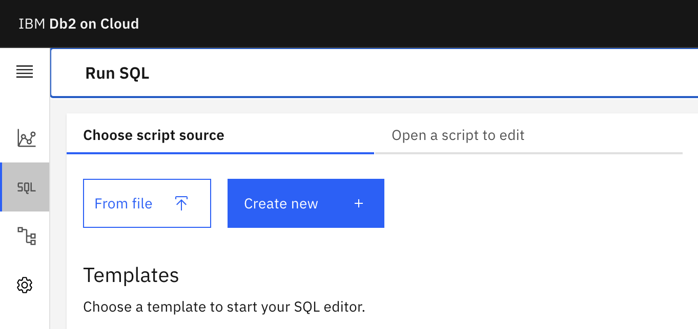

# Building a Music Recognition System with Db2

This code pattern implements an application, “Atomic”, that helps you discover and recognize the music you’re listening to, similar to Shazam! Atomic is built to store the extracted audio data in a Db2 table deployed to Db2 Warehouse on Cloud, and the recognition logic is written as an SQL query. This enables you to scale your instance depending on how many recordings you have and how many requests you need to serve.

When the reader has completed this Code Pattern, they will understand how to:

- Deploy Db2 REST and Db2 Warehouse on Cloud
- Create and call services, and execute SQL, through Db2 REST
- Interface with Db2 REST through Swift and Go
- Implement Shazam’s original “Audio Fingerprinting” logic from 2001

## Prerequisites

The following are prerequisites to deploy this application:

- Xcode 13+, macOS Monterey+, iOS 15+
- Go
- IBM Cloud account
- Docker

## Steps

1. Create a Db2 Warehouse on Cloud instance
1. Setup IBM Cloud CLI and Container Registry
1. Deploy Db2 REST
1. Grab your Db2 Warehouse on Cloud credentials 
1. Setup tables in db2
1. Setup query service in Db2 REST
1. Download a corpus of songs
1. Ingest the corpus of songs
1. Make queries!

### Create a Db2 Warehouse on Cloud instance

In order to store the audio fingerprints and run the query logic, we’ll be deploying Db2 Warehouse on Cloud. Db2 Warehouse is a specific version of Db2 specialized for “analytical” workloads, which are the kind we’ll be running. This means that this instance of the database may not deliver amazing transactional performance (inserting and removing data from tables quickly), but it’s good at taking complex queries that analyze existing data and running them fast.

There are only two times we insert into this database: in the initialization, when we’re setting up the corpus, and when the user is making a query. The former only occurs once and the latter contains very little data, and therefore, we don’t care about transactional performance for this use case.

You can create a Db2 Warehouse on Cloud instance by logging in to IBM Cloud, and then heading to the catalog:


Searching for “Db2” and clicking “Db2 Warehouse on Cloud”:


Finally, choosing the instance size you’d like to deploy and then clicking “create”:


In this example, we’ve chosen to use a Flex instance, because the corpus contains ~200 songs resulting in ~22,000,000 (22 million) hashes. Having extra compute power to quickly query is helpful. If you’re fine with slower queries or would like to use a smaller corpus, feel free to use a lower tier.

When you head back to your dashboard, you should see that the instance you created is being provisioned:


This may take a few minutes, but eventually your instance should be "Active". Then, you’re ready to move on to the next step!

### Setup IBM Cloud CLI and Container Registry

This code pattern will make use of certain docker images only available on the IBM Cloud Container Registry. In order to access them, follow [these steps](https://cloud.ibm.com/docs/cli?topic=cli-getting-started) to setup the IBM Cloud CLI on your machine. Follow steps 1-3, and note that you will not need to access cloud foundry services for this code pattern.

After setting up the CLI and logging into IBM Cloud through it, you will need to enable the "container registry" plugin. You can do so by running the following command:

```bash
ibmcloud plugin install container-registry
```

Then, run the following commands to setup the container registry such that we can find the required images:

```
ibmcloud cr region-set global
ibmcloud cr login
```

Now, when you run the relevant `docker pull` and `docker run` commands, they will be able to grab the correct images.

### Deploy Db2 REST

In order to run SQL on your Db2 instance from your code, we’ll use Db2 REST. Db2 REST makes it easy to interface with Db2 from any programming language.

You can deploy Db2 REST with one simple `docker run` command:

```bash
docker run -it --name=db2rest -p 50050:50050 -e LICENSE=accept -e DB2REST_USE_HTTP=true icr.io/obs/hdm/db2rest:latest-amd64
```

Now, you should be able to access Db2 REST at port 50050, and you can access documentation at `http://<IP>:50050/docs`. Make sure that you deploy Db2 REST to a machine that you can access via network from where you will deploy the Atomic application. If you’re running this locally and cannot connect to your machine with a public IP address, feel free to tunnel your connection using a service like [ngrok](https://ngrok.io).

### Grab your Db2 Warehouse on Cloud credentials

To get the information you need to connect to your Db2 Warehouse on Cloud instance, simply click on the “Credentials” tab on the left:


Then, click "New credential", and "Add":


Once you've added your credentials, find your hostname, port, username, and password. You should see a section like this, containing the username and password:

```json
      "authentication": {
        "method": "direct",
        "password": "<PASSWORD>",
        "username": "<USERNAME>"
      },
```

And another section like this one with the hostname and port:

```json
      "hosts": [
        {
          "hostname": "<HOSTNAME>",
          "port": <PORT>
        }
      ],
```

### Setup tables in Db2

Now, we’ll setup the tables that will store the data for Atomic to run its queries and surface information to the user. There are three tables we’ll use:

- FILELIST: this table will contain the names and unique IDs of the audio files that the corpus consists of
- REFHASH: this table will contain hashes and their timestamps associated with the unique ID of the file that they come from
- QUERYHASH: this table will contain hashes and their timestamps associated with the unique query ID that they’re a part of

When deploying atomic, we assign each file a unique ID and insert it into FILELIST, and its hashes into REFHASH. When the user runs a query, we generate a random query ID, and upload the hashes of their snippet of audio into QUERYHASH.

We will create the tables we require through the Db2 Warehouse on Cloud console UI. Click on your service from your IBM Cloud dashboard, and then click on “Open Console”:


On the left, click “SQL”:


Finally, click on "Create new" to create a new SQL script that you can run against your instance:



You should now see an interface in which you can run arbitrary SQL against your instance. We’ll run the following SQL to create the tables we need — make sure to replace `<USERNAME>` with the username you got from the previous step:

```sql
CREATE TABLE "<USERNAME>".FILELIST (FILEID INT NOT NULL, FILENAME VARCHAR(255) NOT NULL)
CREATE TABLE "<USERNAME>".REFHASH (FILEID INT NOT NULL, HASH BIGINT NOT NULL, TIME BIGINT NOT NULL)
CREATE TABLE "<USERNAME>".QUERYHASH (QUERYID INT NOT NULL, HASH BIGINT NOT NULL, TIME BIGINT NOT NULL)

GRANT SELECT ON "<USERNAME>".FILELIST TO "<USERNAME>";
GRANT SELECT ON "<USERNAME>".REFHASH TO "<USERNAME>";
GRANT SELECT ON "<USERNAME>".QUERYHASH TO "<USERNAME>";
```

Your tables, and the permissions to access them, are now set up!

### Setup query service in Db2 REST

While Db2 REST does allow you to run raw SQL against your database through a REST API, there is a better way of interacting with your data. This is through the use of “services”. These effectively tell Db2 REST “here’s an SQL query that expects parameters XYZ as input”. Then, Db2 REST will create a REST endpoint specifically for this query, expecting the parameters that you specified, and will pass them to Db2 safely along with your query. This inherently prevents, for example, SQL injection attacks, and makes it so your client-side is detached from SQL query details.

We're only going to register a single service against our Db2 REST server, called `GetScores`. This service will take a single parameter, `QueryID`, referring to the id column in the `QUERYHASH` table, which is used to distinguish between hashes of different queries. You can set this up by running the `setup_rest.py` script from this repo. First, change the following section of code to match your credentials:

```python
    auth_body = {
      "dbParms": {
        "dbHost": "<DATABASE HOSTNAME>",
        "dbName": "bludb",
        "dbPort": <PORT>,
        "isSSLConnection": True,
        "password": "<PASSWORD>",
        "username": "<USERNAME>"
      },
      "expiryTime": "24h"
    }
  
    rest_endpoint = "http://<REST HOSTNAME>:50050"
```

Note that `bludb` is the default database name for Db2 Warehouse on Cloud instances. Now, you can run the script:

```bash
python3 setup/setup_rest.py
```

### Download a corpus of songs

Atomic can ingest any audio file. In this case, we’ll demonstrate feeding Atomic with a corpus of songs, so the application implements a music discovery use case similar to Shazam. This code pattern uses [the following playlist](https://www.youtube.com/playlist?list=PLiWcnsSmNaTeYa4Y2IFrcZEVUmcFofmif) of music as a corpus.

In order to download them, we’ll use the `youtube-dl` program. You can find installation instructions here: https://ytdl-org.github.io/youtube-dl/download.html

Simply run this command to download all the music from the YouTube Music playlist:

```bash
youtube-dl "https://www.youtube.com/playlist?list=PLiWcnsSmNaTeYa4Y2IFrcZEVUmcFofmif" -f 140
```

The directory you run this command in will now contain audio files corresponding to each song youtube-dl downloaded. The naming scheme for these files is important:

```
[title]-[video_id].[extension]
```

It starts with the title of the song, then its video ID on YouTube after a dash, and then the file extension. This scheme is expected by the frontend, as it’s used to extract the video ID of the match, and therefore the thumbnail that we need to display to the user.

Once the corpus has been downloaded, there is one more thing you need to do — and that is convert all of your audio files to `.wav` format. This is because the server-side implementation of Atomic (in Go) only supports reading wav files. You can do this simply with the following command:

```bash
for i in *.m4a; do ffmpeg -i $i "$i".wav; done
```

Now you’re ready to ingest the corpus!

### Ingest the corpus of songs

NOTE — A prerequisite for this section is that you download, configure, make, and install the "FFTW" (Fastest Fourier Transform in the West) library, version 3. Also ensure that during configuration/making, you export the following environment variables to ensure the next steps work properly:

```bash
export CFLAGS="-fPIC"
export CXXFLAGS="-fPIC"
```

You’re going to use the code from this repository to ingest the corpus of songs, which consists of reading the audio files you downloaded, extracting fingerprints, and then uploading those fingerprints to Db2. 

Start by modifying this section of `atomic-go/main.go`:

```go
    authSettings := AuthSettings{
        RestHostname: "<HOSTNAME OF REST SERVER>",
        DBHostname: "<HOSTNAME OF DB2 INSTANCE>",
        Database: "BLUDB",
        DBPort: <DATABASE PORT>,
        RestPort: 50050,
        SSL: true,
        Password: "<PASSWORD>",
        Username: "<USERNAME>",
        ExpiryTime: "24h",
    }
```

Replace these placeholders with the actual authentication information from your Db2 Warehouse instance, and the RestHost and RestPort properties with the connection details to your Db2 REST deployment. Also replace the following placeholder with the path to the directory containing your wavs:

```go
    err = IngestSongs("<PATH TO DIRECTORY OF WAV FILES>", handler, authToken, authSettings)
```

Then, build and run atomic-go:

```bash
clang FFTHandler.c -L/usr/local/lib -lfftw3 -lm -Ofast -shared -fPIC -o libffthandler.so
go build .
./atomic
```

NOTE — because the shared library for the fourier transform and spectrogram utilities was compiled to the same directory as the Go application, and not the OS default library search locations, you may need to add this path to the search locations before the invocation of the atomic binary is successful. On Ubuntu, for example, you could run the following command from the directory containing the shared library to add it to the library search paths:

```bash
export LD_LIBRARY_PATH=$(pwd):$LD_LIBRARY_PATH
```

Once you run the code, you should start to see output that looks like this:

```
/root/allsongs/Claudia-Hoyser-Summertime-Song-ddRzsykRCHQ.mp3.wav
/root/allsongs/Emily-Vaughn-wheredoesthelovego-yEfwskPeppE.mp3.wav
/root/allsongs/Kiiara-Empty-NR3uUfM98F4.mp3.wav
/root/allsongs/Maggie-Lindemann-Would-I-RDxEI1Hwsfo.mp3.wav
```

Every audio file that’s printed this way is another one that’s been uploaded to Db2. In a few minutes, you should be finished loading in your data!

### Make queries!

It’s finally time — you’ve got Db2 REST and Db2 setup, you’ve downloaded your corpus, and you’ve ingested that corpus into your database. You can get started making queries.

Simply open `atomic-ios/Atomic/Atomic.xcodeproj`, and modify the following code in ContentView.swift:

```swift
db2 = try! Db2Handler(authSettings: .init(hostnameREST: "<HOSTNAME OF REST SERVER>",
                                          hostnameDB: "<HOSTNAME OF DB2 INSTANCE>",
                                          database: "BLUDB", dbPort: <DATABASE PORT>, restPort: 50050,
                                          ssl: true, password: "<PASSWORD>",
                                          username: "<USERNAME>", expiryTime: "24h"))
```

Then run the project from Xcode. Now, on your device, you should be able to record a 7 second snippet of any song from the corpus, and the application should be able to identify the song and display the title of its corresponding video from YouTube alongside its thumbnail. Again, due to the way the audio fingerprinting technology works, it should be able to accurately recognize songs even in noisy environments.
